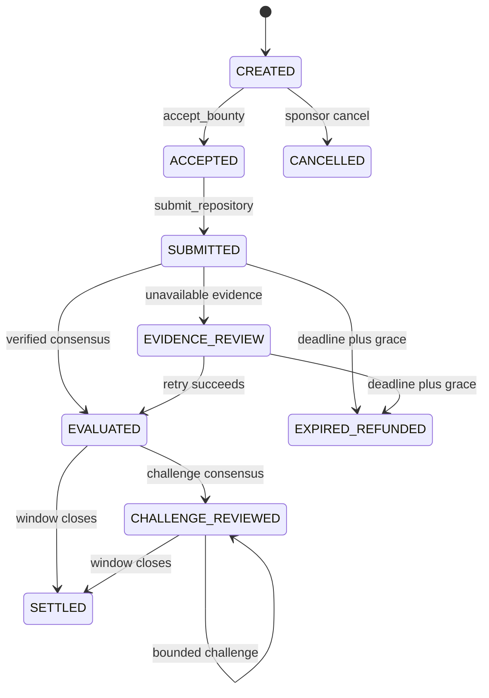

# LicenseBounty architecture

## Trust boundary

The sponsor locks a rule set and receives a SHA-256 `terms_hash`. The developer must accept that exact hash before submitting. A submission is not a mutable branch URL: it is a canonical GitHub repository URL plus a lowercase, full commit SHA. The contract discovers files from the pinned Git tree and stores a digest/byte-length manifest of every fetched evidence file.

The LLM never decides which evidence to fetch. Deterministic code chooses the GitHub tree endpoint, license-name candidates, manifest candidates, and the developer-supplied dependency evidence URLs. The prompt receives those fetched bytes as untrusted evidence and explicitly ignores instructions inside them.

## State machine

## Settlement policy

| Current verdict | Settlement |
| --- | --- |
| `COMPLIANT` | 100% to developer |
| `PARTIALLY_COMPLIANT` | locked `partial_payout_bps` to developer; remainder to sponsor |
| `REJECTED` | 100% refund to sponsor |
| no usable review by deadline + grace | 100% refund to sponsor |

## Consensus safety

The leader returns only bounded JSON fields. Validators reject malformed verdicts, invalid scores, missing evidence manifests, mismatched SHA-256 digests, changed candidate paths, and unsupported citations. Validators independently fetch the pinned commit and independently ask whether the result is acceptable. Dynamic transport failure is never converted into a payout.
